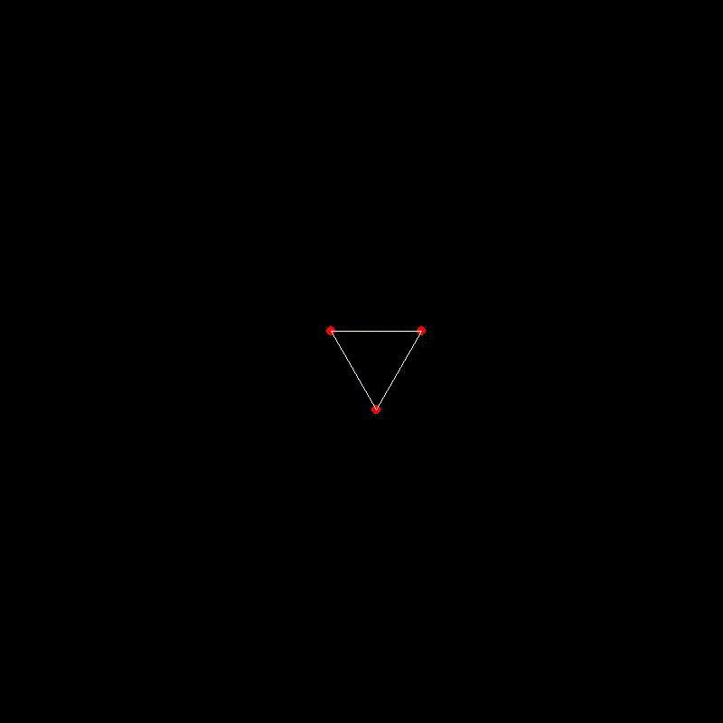

# 3D Render – AI-Generated Primitive Shapes

A 3D renderer that leverages **ChatGPT** to generate and visualize primitive shapes based on natural language input. From shape request to animation, this project offers an end-to-end pipeline for creating and rendering 3D models.

---

## Overview

This project allows users to input a description of a basic 3D shape (like *cube*, *sphere*, or *cylinder*), which is then interpreted by ChatGPT to generate a corresponding STL (stereolithography) file. The STL file is parsed and rendered into an animated 3D scene using a vertex connectivity algorithm.

---

## Features

- **AI-Powered Shape Generation**  
  Uses ChatGPT to interpret user input and generate accurate STL geometry files.

- **Primitive Shape Support**  
  Currently supports common primitives such as:
  - Cube
  - Sphere
  - Cylinder
  - Triangular prism  

- **STL File Parsing**  
  Efficiently parses ASCII STL files to extract vertex and facet information.

- **Real-Time 3D Rendering**  
  Renders the parsed 3D model using a simple animated camera for visual effect.

- **Animation Support**  
  Adds rotation and transformations to bring the model to life.

---

## Tech Stack

- ChatGPT (to dynamically generate STL files)
- STL file format (ASCII)
- Python
- PyGame for Rendering

---

## How It Works

1. **Input:**  
   User inputs a description of a primitive shape (e.g., "generate a cube").

2. **AI Generation:**  
   ChatGPT generates the corresponding STL file based on the request.

3. **Parsing:**  
   The STL file is parsed to extract vertices and facet data.

4. **Rendering:**  
   The shape is displayed in a 3D environment with rotation/animation for visualization.

---

## Demo



---

## Installation

```bash
git clone https://github.com/yourusername/3d-render-engine.git
cd 3d-render-engine

# Set up virtual environment (optional but recommended)
python3 -m venv venv
source venv/bin/activate  # On macOS/Linux
venv\Scripts\activate     # On Windows

# Install all dependencies and run
python3 render.py
